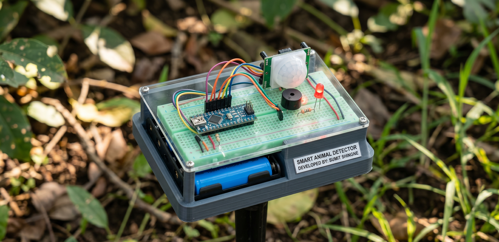

# Wildlife Monitoring and Alert System

**Arduino Nano-based Smart Animal Detector System**

---

## Demo Video

 
▶️ [Watch on YouTube Shorts](https://youtube.com/shorts/Aws9VVFuRyI?si=V7WdtzoC7ly55wIl)

---

## Get the Project

Want to support the project or get the complete package? 
➡️ [Purchase on Payhip](https://payhip.com/Iotproject)

---

## Circuit Connections

### PIR Sensor
| PIR Sensor Pin | Arduino Nano Pin |
|:---:|:---:|
| VCC | 5V |
| GND | GND |
| OUT | D2 |

### Buzzer
| Buzzer Pin | Arduino Nano Pin |
|:---:|:---:|
| +   | D8  |
| -   | GND |

### LED
| LED Pin | Arduino Nano Pin |
|:---:|:---:|
| Positive (+) | D13 |
| Negative (–) | 220Ω Resistor → GND |

---

Feel free to update this file with more details about usage, features, or schematics as your project evolves!
